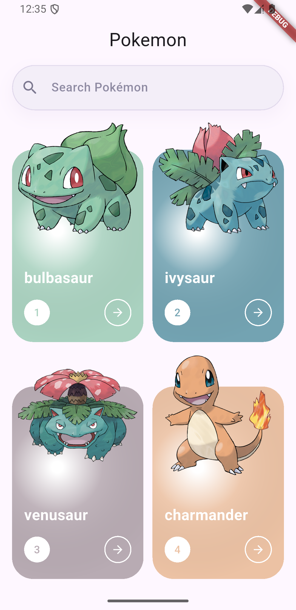
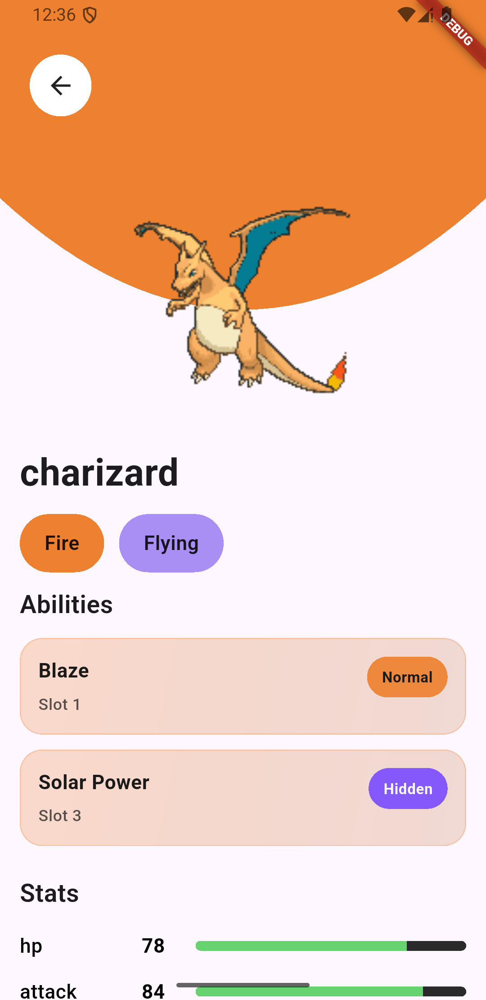

## Getting Started

### 1. Clone the repository

git clone https://github.com/yourusername/pokevault.git

### 2. Install dependencies

flutter pub get

### 3. Run the project

flutter run

# PokéVault Flutter App

A Flutter mobile application that displays Pokémon data from the PokeAPI.  
This project was built as part of a Flutter Technical Assessment.

The application demonstrates clean architecture, reactive state management, and a responsive UI.

## Features

- Pokémon discovery screen with pagination
- Search Pokémon by name
- Pokémon detail screen
- Dynamic UI color based on Pokémon type
- Display Pokémon abilities and stats
- Smooth loading states with shimmer animations
- Animated transitions between loading and content
- Clean architecture implementation
- Error handling and retry mechanism

## Tech Stack

- Flutter
- GetX (State Management & Navigation)
- Dio (Networking)
- Equatable (Entity equality)
- Shimmer (Loading UI)

## Architecture

This project follows a Clean Architecture approach with three main layers:
Data Layer
Handles API calls, models, and repository implementations.

Domain Layer
Contains entities and use cases representing business logic.

Presentation Layer
Contains UI, controllers, and widgets using GetX state management.

## State Management

The app uses GetX for reactive state management.

Key benefits:

- Lightweight
- Simple reactive programming using Rx variables
- Built-in dependency injection
- Easy navigation management

## Networking

The app uses Dio for API communication with the PokeAPI.

Features implemented:

- API client abstraction
- Error handling
- JSON serialization
- Pagination support

## Pagination

The home screen implements infinite scrolling using the PokeAPI `/pokemon` endpoint.

- 20 items per page
- Automatically loads more data when reaching the bottom of the list

## Environment

The project was developed using the following environment:

- Flutter: 3.38.3 (stable)
- Dart: 3.10.1
- Android SDK: 35
- Java / JDK: 21

## Preview

| Home Screen               | Detail Screen               |
| ------------------------- | --------------------------- |
|  |  |

## Author

Developed by Handika Djati Dharma

Flutter Developer Technical Assessment
# pokemon-app
